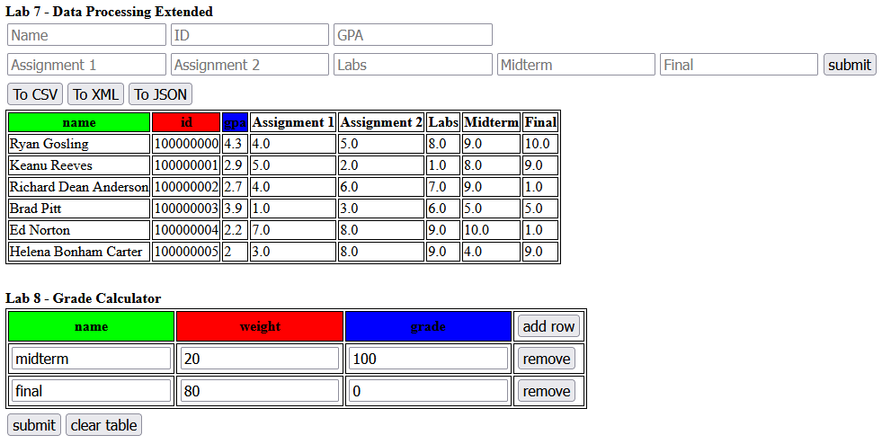
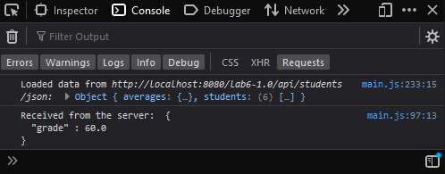

# Lab 8 - Grade Calculator (Front End)

For this lab, you will build upon your previous labs, but you are going to focus on the `index.html` and `main.js` files to add a new table and its functionalities for the user interaction.
You are going to implement an extensible table which can remove its own rows and add more rows to itself.

In the end, your website should look similar to this:

Website:

[](index.html)

Console:

[](js/main.js)

## Lab Work

Here's some boilerplate code:

```html
<!-- previous labs --->
<div class="row">
  <button id="to_csv">To CSV</button>
  <button id="to_xml">To XML</button>
  <button id="to_json">To JSON</button>
</div>
<table id="chart"></table>
<br />
<!-- new lab code --->
<h1>Lab 8 - Grade Calculator</h1>
<table id="grades">
    <thead>
        <tr>
          <th class="green">name</th>
          <th class="red">weight</th>
          <th class="blue">grade</th> 
          <th><button id="grades_add" onclick="add_row('grades')">add row</button></th>
        </tr>
    </thead>
    <tbody>
        <tr key="1">
          <td><input placeholder="name" /></td>
          <td><input placeholder="weight" /></td>
          <td><input placeholder="grade" /></td>
          <td><button onclick="remove_row(1)">remove</button></td>
        </tr>
    </tbody>
</table>
<div class="row">
    <button id="grades_submit" onclick="scrape_grades()">submit</button>
    <button id="grades_clear" onclick="clear_table('grades')">clear table</button>
</div>
```

This is the template of your grade calculator and each `<tr>` element should have an attribute `key` which has a unique value.

Note that:

- there should always be one `<tr>` present
- buttons with IDs
  - `grades_add` must exist and should invoke `add_row()`
  - `grades_submit` must exist and should invoke `scrape_grades()`
  - `grades_clear` must exist and should invoke `clear_table()`

>This code is supposed to go in your `index.html` file, below all the code from the previous labs.

### Adding Functionality

The table `<table id="grades">` should be able to perform the following actions:

- add new rows to itself that all have a unique value for the custom attribute `key`
- remove rows based off their `key` attribute
- be updated without losing the values within each `<input>` tag

Finally, the button `<button id="grades_submit">` should make a `POST` request `onclick` to the new endpoint that you're going to create in [lab 9](../api/) which is:

```sh
/lab6-1.0/api/format/grades
```

The body of the request will be a JSON object created by the function `scrape_grades()` (see source below), this function looks at all of the `<tr>` elements that have `key`.
The JSON object it returns should be used as the body of the request.

```js
/**
 * A grade object
 * @typedef Grade
 * @property {String} name the name of the node
 * @property {Number} weight the weight of the node
 * @property {Number} grade the grade achieved
 */

/**
 * this function finds each `<input key>` element and grabs its value along with its placeholder
 * text and forms an array of JSON objects to be sent to the server
 *
 * this function also makes a call to `post_to_server()`
 */
function scrape_grades() {
  /** @type {Grade[]} */
  const grades = [];

  // getting a reference to the tbody
  const tbody = document
    .getElementById("grades")
    .getElementsByTagName("tbody")[0];

  // iterating through the <tr>s of the table
  tbody.querySelectorAll("tr[key]").forEach((row) => {
    /**
     * making a new Grade object
     * @type {Grade}
     */
    const obj = {};

    // iterating over each input and adding a KV pair to the obj var
    row.querySelectorAll("input").forEach((input) => {
      obj[input.getAttribute("placeholder")] = input.value;
    });

    // adding the obj to the main grades var
    grades.push(obj);
  });

  /// making a post request to the server

  // turning the JSON object into string format to be sent to the server
  const payload = JSON.stringify({ grades: grades });

  // setting the url of the server
  const url = "http://localhost:8080/lab6-1.0/api/format/grade";

  // setting the headers
  const headers = [
    ["Content-Type", "application/json"], // setting the sending content-type
    ["Accept", "application/json"], // setting the receiving content-type
  ];

  // you need to modify your own post_to_server function
  post_to_server(
    payload, // transforming grades into string like format
    headers, // the headers
    url
  );
}
```

Finally, you should modify the `post_to_server()` function such that it can take a direct payload e.g., you pass in an object into the function and it will be encoded into the body.

#### JavaScript

In a new filed called `js/grade.js`, implement the following functions:

- `add_row(id)` should:
  - generate a new `<tr>` element (that follows the schema above) that has a unique value for the attribute `key`
  - append the new `<tr>` to the `<tbody>` of the `<table id=id>`
    - note that the code should updated such that the values within each `<input>` tag do not disappear (editing the `innerHTML` will cause this to happen)
- `remove_row(value)` should:
  - delete the element whose `key` attribute is `value`
- `clear_table(id)` should:
  - remove any children elements of any `<tbody>` of any `<table id=id>`

>This should just copy the format of the rows above and paste it as a new table row.  
>Ultimately, it doesn't necessarily matter how you generate the IDs for the `<tr>` elements as long as they are unique.

#### Useful Functions

Some functions of note:

1. [`querySelectorAll()`](https://developer.mozilla.org/en-US/docs/Web/API/Document/querySelectorAll): very helpful to index any `key` attribute
2. [`insertAdjacentHTML()`](https://developer.mozilla.org/en-US/docs/Web/API/Element/insertAdjacentHTML): this inserts HTML in an element and doesn't destroy and previous elements

## Grading

The grading tests for functionality, not the internal logic. Meaning that as long as your function does what it's supposed to, it doesn't matter if it makes 1000 other function calls.

Conceptually, as a user, if I click a button that says "Add row" I should expect a new row to appear on my screen, in the most logical spot as well -- for example, new row should be added to the `<tbody>` of the table `grades`.
